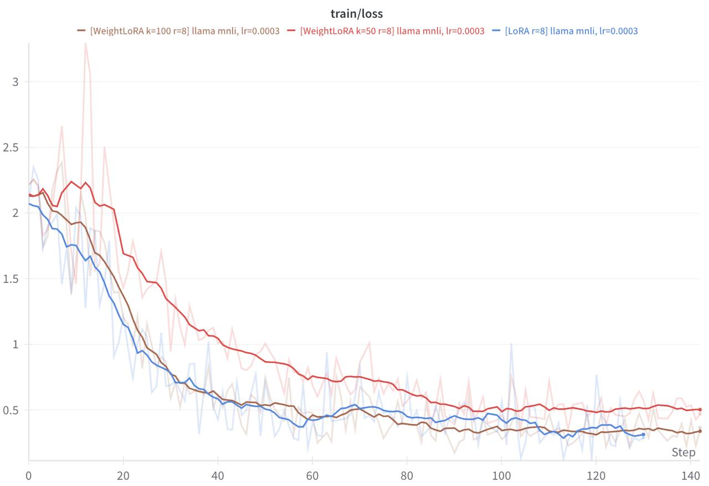
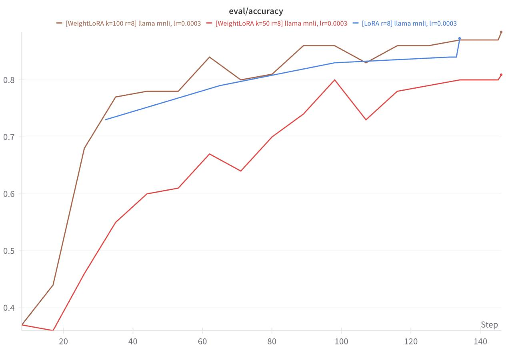
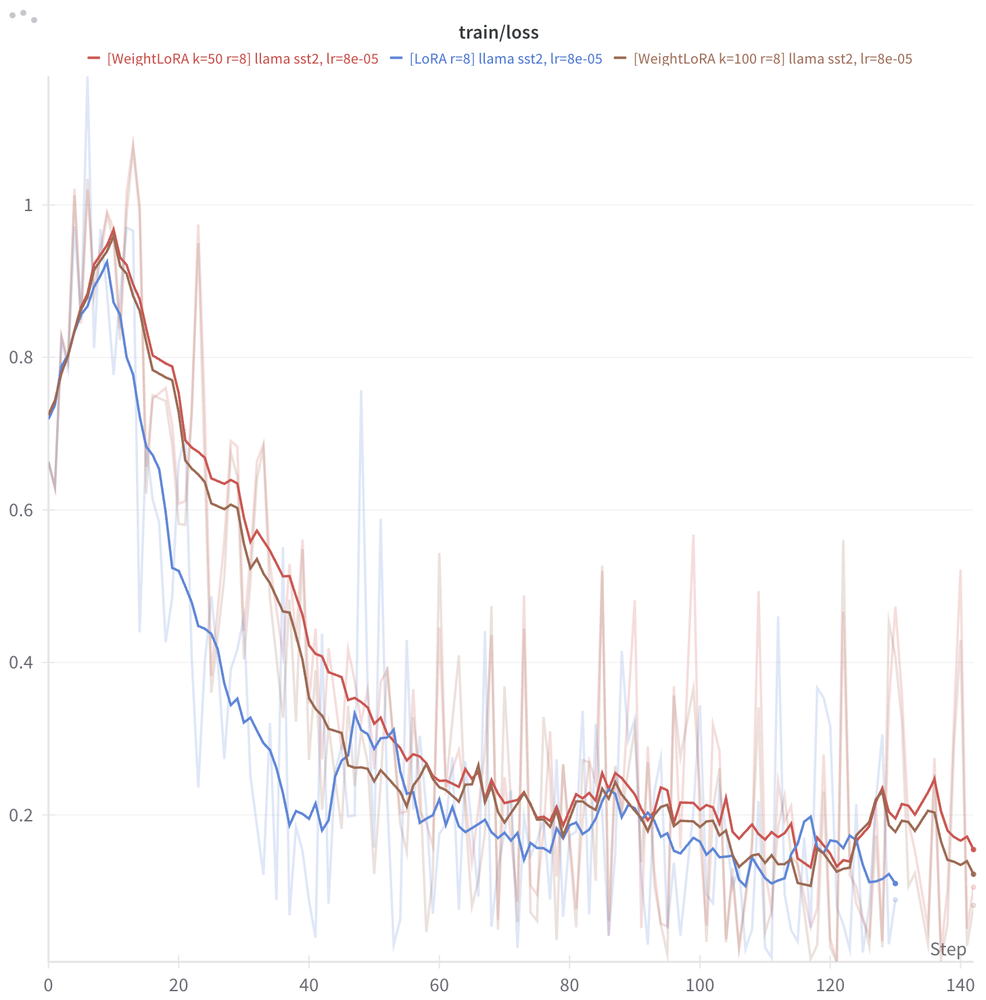
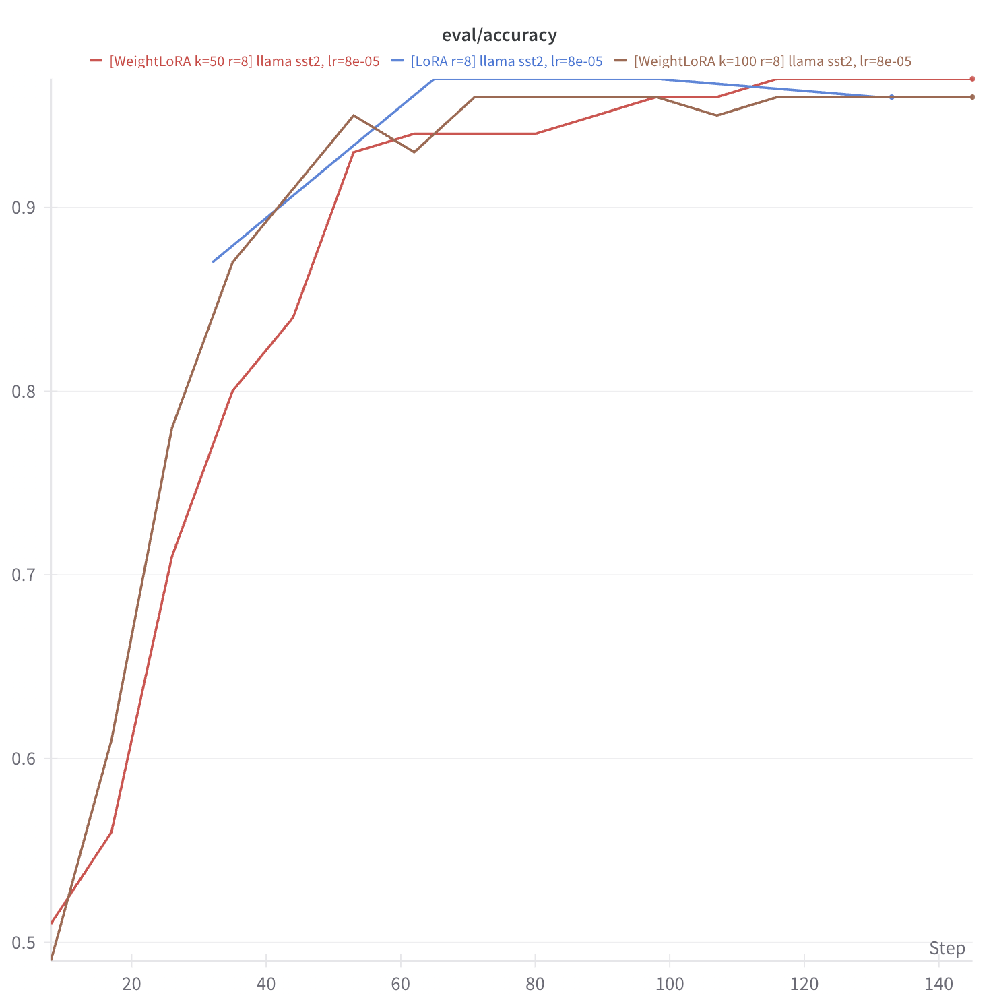

# Llama 3.1 8B Experiments

## GLUE MNLI

**Parameters**
- batch size 16
- learning rate 3e-4
- max steps 128
- scheduler cosine
- warmup steps 10
- r 8

 

## GLUE SST-2

**Parameters**
- batch size 16
- learning rate 8e-5
- max steps 128
- scheduler cosine
- warmup steps 10

 
