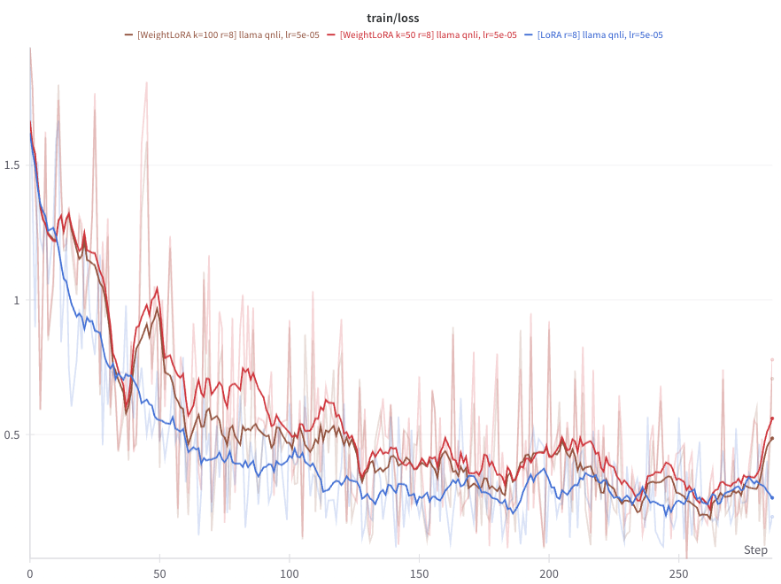
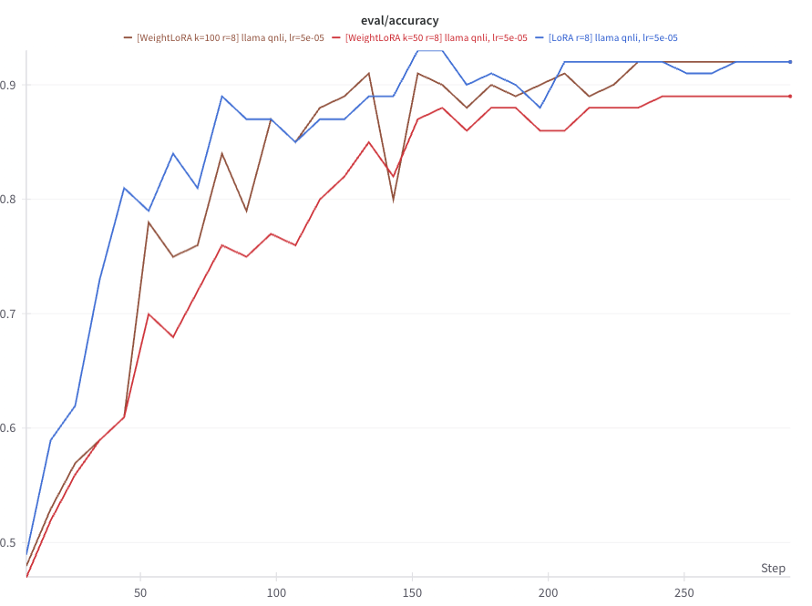
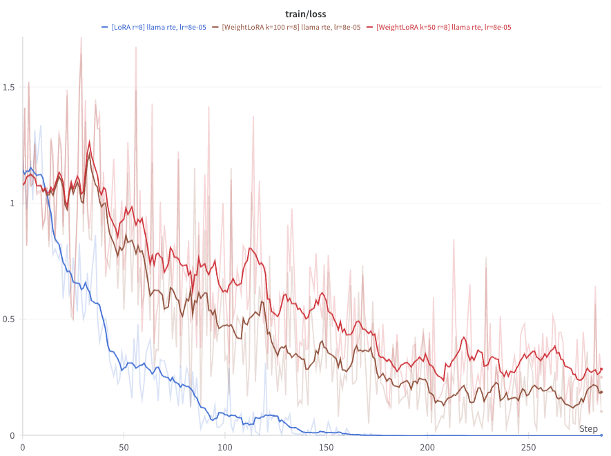
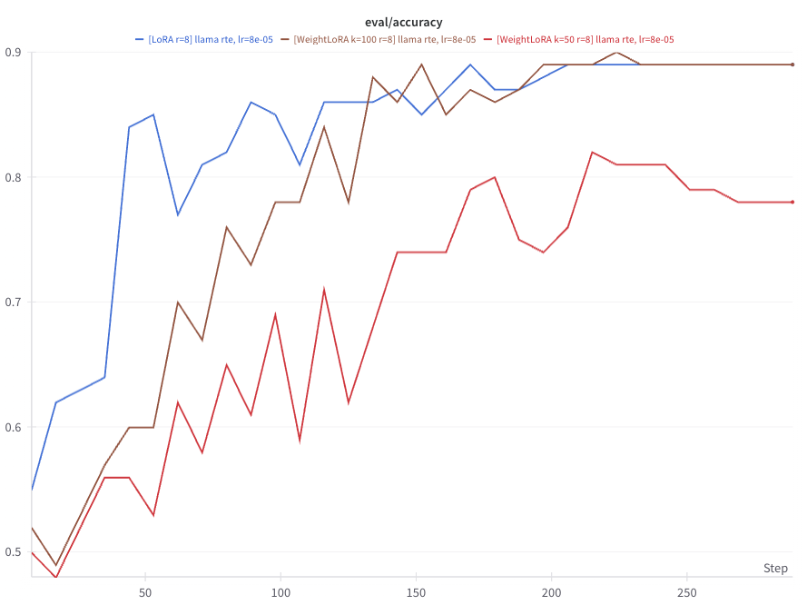
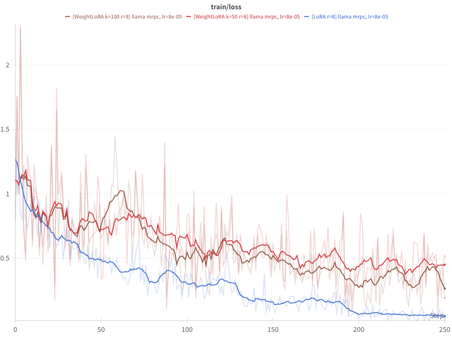
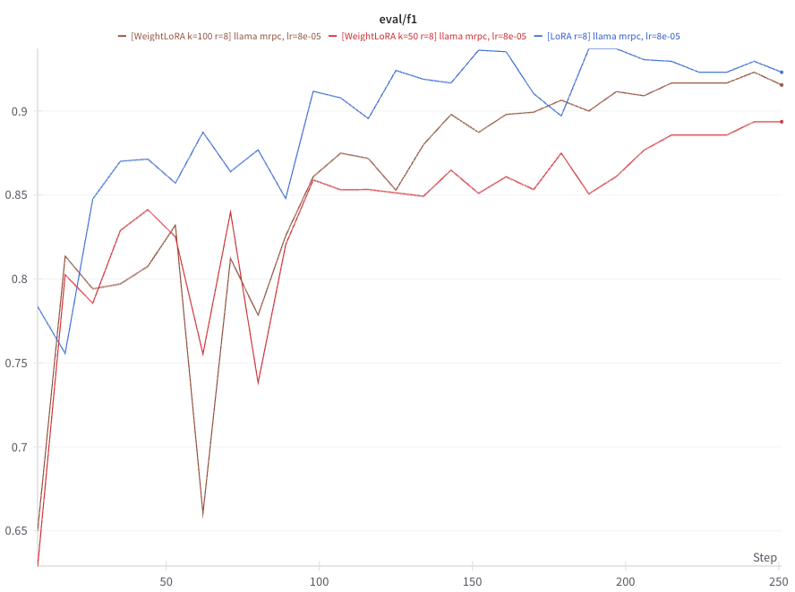

# Llama 3.1 8B Experiments

## GLUE MNLI

**Parameters**
- batch size=16
- learning rate=3e-4
- max steps=128
- scheduler=cosine
- warmup steps=10
- r=8

 

## GLUE SST-2

**Parameters**
- batch size=16
- learning rate=8e-5
- max steps=128
- scheduler=cosine
- warmup steps=10
- r=8

 

## GLUE QNLI

**Parameters**
- batch size=8
- learning=rate 5e-5
- max steps=56
- scheduler=cosine
- warmup steps=10
- r=8

 

## GLUE RTE

**Parameters**
- batch size=32
- learning rate=8e-5
- max steps=256
- scheduler=cosine
- warmup steps=10
- r=8

 

## GLUE MRPC

**Parameters**
- batch size=8 (for lora=32)
- learning rate=8e-5
- max steps=251
- scheduler=cosine
- warmup steps=10
- r=8

 
